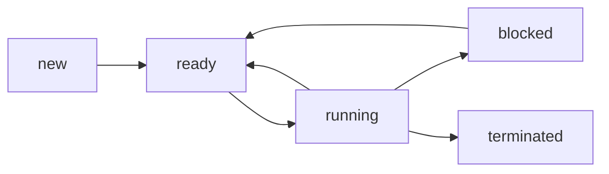

## Content
The OS review will cover four modules 
* Process
* Concurrency
* Memory Management
* File system

## Process

### What is a process
Process is an abstarction of a running program,
it contains:

-  Resources: registers, logical address space, files, IO devices
-  Instructions that get run on the CPU (1 or more threads)

### Process control block
A kernel data structure contains
- process id
- process state
- address space, 

###	Process state
  - New
  - Running
  - Blocked
  - Ready 
  - Terminated

### Process state transition

Note the difference between $ Running \rarr Ready $ and $ Running  \rarr Blocked $.   
$ Running \rarr Ready $ is triggered by OS interrupts, when a process with higher priority needs to use the cpu, the OS changes the one using the cpu from running state to ready state.  
$ Running \rarr Blocked $ means that a process proactively stops using the cpu, waiting for operations such as IO.

### Context switch
A context switch means that the OS removes the old process from the CPU and loads the new process, like switching the workers on the pipeline.   
When it happens, OS will
1. Save the cpu context (registers, program counter, stack pointer, etc.) of current process to its PCB
2. Update the process state in process control block
3. Load the CPU context of the next scheduled process from its PCB
4. Switch the address space by updating the page table base register

### Architecture and OS
> Exam Question: Scenarios of OS to take architecture into account
1. The access to disk is always slower than the access to RAM. Therefore the operating system should determine how to fetch pages to ensure fast access.
2. There are multiple cores in the computer, OS need to decide which process is assigned to which core.

---

*最后更新：2026-1-11*